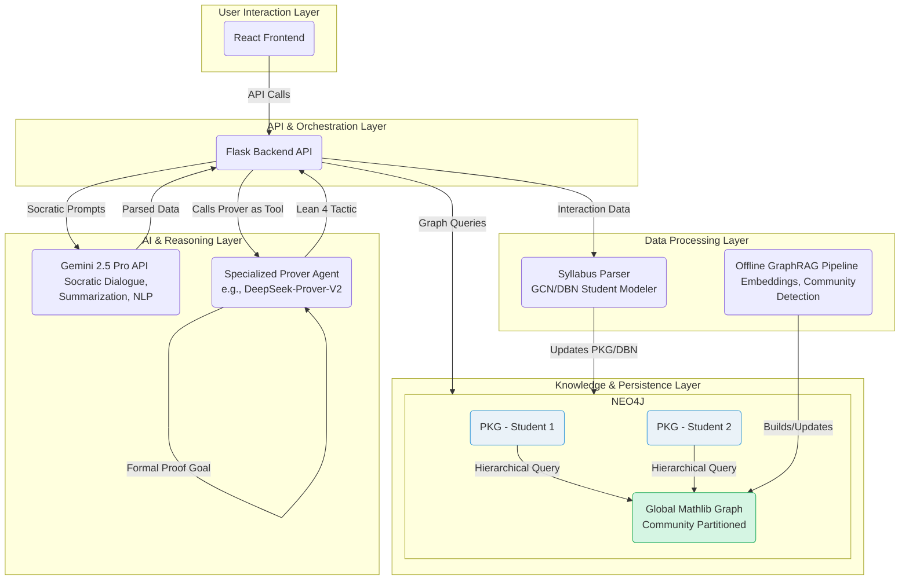
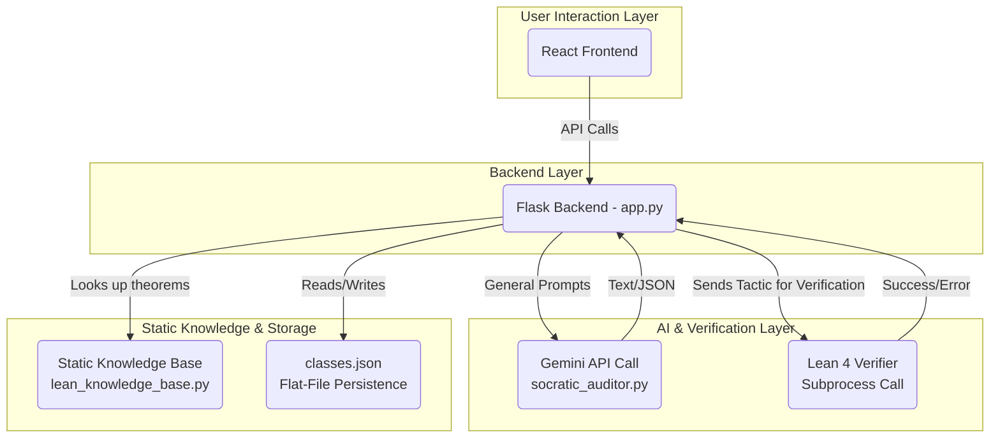

# 🚀 Altera Labs - AI-Powered Math Education Platform

An intelligent tutoring system combining Lean 4 theorem proving with AI to provide personalized math education.

## Prerequisites (host)
- Docker Desktop: [Install](https://docs.docker.com/desktop/)
- VS Code or Cursor: [VS Code](https://code.visualstudio.com/) | [Cursor](https://www.cursor.com/)
- Dev Containers (VS Code): [Extension](https://marketplace.visualstudio.com/items?itemName=ms-vscode-remote.remote-containers)
- Google Cloud SDK (gcloud CLI): [Install](https://cloud.google.com/sdk/docs/install)
- Optional (only if running outside the container): Node.js/npm [Install](https://nodejs.org/en/download/package-manager)

## 🎯 Quick Start

1) Clone
```bash
git clone <repository-url>
cd Altera-Labs
```

2) Open in Dev Container (recommended)
- Open in VS Code or Cursor and choose “Reopen in Container”
- First build takes ~5–10 minutes

3) Authenticate Google Cloud (one-time on your host)
- If you do not have gcloud yet: [Install the Google Cloud SDK](https://cloud.google.com/sdk/docs/install)
```bash
gcloud auth application-default login
```
This provides credentials to the container via the mounted `~/.config/gcloud` directory.

4) Start development
```bash
# Use the management script (recommended)
./scripts/manage.sh development start

# Or manual:
# Backend (Flask API)
cd backend && python -m app

# Frontend (React + Vite)
# First time only, from repo root:
npm install
cd frontend && npm install && npm run dev
```

## 🔧 What the Dev Container Sets Up Automatically
- Python 3.10, Node.js 20, Git (via features)
- A project-local virtualenv at `.venv` with `backend/requirements.txt` installed
- Root toolchain for Tailwind/PostCSS via `npm install` at repo root
- Frontend dependencies via `frontend/package.json`
- Lean 4 via `elan` and a `lake build` of `backend/lean_verifier`
- Environment variables for Vertex AI usage inside the container:
  - `VERTEX_AI_PROJECT_ID=altera-labs`
  - `VERTEX_AI_LOCATION=us-east1`
- If present on your host, your Google Cloud credentials directory is mounted into the container. Note: the `gcloud` CLI is not installed in the container.

## 🏗️ Project Structure
```
Altera-Labs/
├── backend/                 # Python Flask API and Lean integration
│   ├── app.py               # Main application
│   ├── requirements.txt     # Python dependencies
│   ├── lean_verifier/       # Lean 4 project (lake)
│   └── tests/               # Pytest-based tests
├── frontend/                # React + TypeScript (Vite)
│   ├── package.json
│   └── ARCHITECTURE.md
├── scripts/                 # Helper scripts
│   └── manage.sh            # Unified management script
├── .devcontainer/           # Dev container configuration
│   ├── devcontainer.json
│   └── post-create.sh
├── docs/                    # Additional documentation
└── package.json             # Root toolchain (Tailwind/PostCSS)
```

## 🚀 Running the Application

- Backend (Flask API)
```bash
cd backend
python -m app
# API served at http://localhost:5000
```

- Frontend (React + Vite)
```bash
# First time on a new machine (from repo root)
npm install

cd frontend
npm install
npm run dev
# App served at http://localhost:5173
```

- Lean Development
```bash
cd backend/lean_verifier
lake build
```

## 🧪 Testing
- Backend: pytest in `backend/tests/`
```bash
cd backend
pytest
```
- Frontend: a test suite is not configured yet
- Lean: build via `lake build`

## 🛠️ Management Script
Common tasks are consolidated in `./scripts/manage.sh`:
```bash
# Container
./scripts/manage.sh container rebuild
./scripts/manage.sh container diagnose

# Dependencies
./scripts/manage.sh dependencies verify
./scripts/manage.sh dependencies install

# Development
./scripts/manage.sh development start
./scripts/manage.sh development build

# Maintenance
./scripts/manage.sh maintenance cleanup
./scripts/manage.sh maintenance backup
```

## 📚 Documentation and Models
- Frontend Architecture: `frontend/ARCHITECTURE.md`
- Technical Specification: `TECHNICAL_SPEC.md`

### Models
- Primary LLM: Gemini 2.5 Pro (Vertex AI)
- Prover Agent: optional specialized prover (e.g., DeepSeek‑Prover‑V2) called as a tool
- Lean 4 + Mathlib for formal verification

## 🔐 Security Notes
- Google Cloud credentials (if present on host) are mounted read-only into the container
- No sensitive data is committed to the repository

## 🤝 Contributing
1. Fork the repository
2. Create a feature branch
3. Make changes with tests where applicable
4. Open a pull request

## 📞 Getting Help
- Check terminal logs
- Re-run `.devcontainer/post-create.sh` inside the container
- Ask the team

---

## 2.4. System Architecture Diagrams

The following diagrams visualize the planned architecture and the current implementation. These, along with our model choices, are central to the system design.

Diagram 1: Planned Hierarchical Knowledge Architecture



Diagram 2: Current Implemented Architecture


