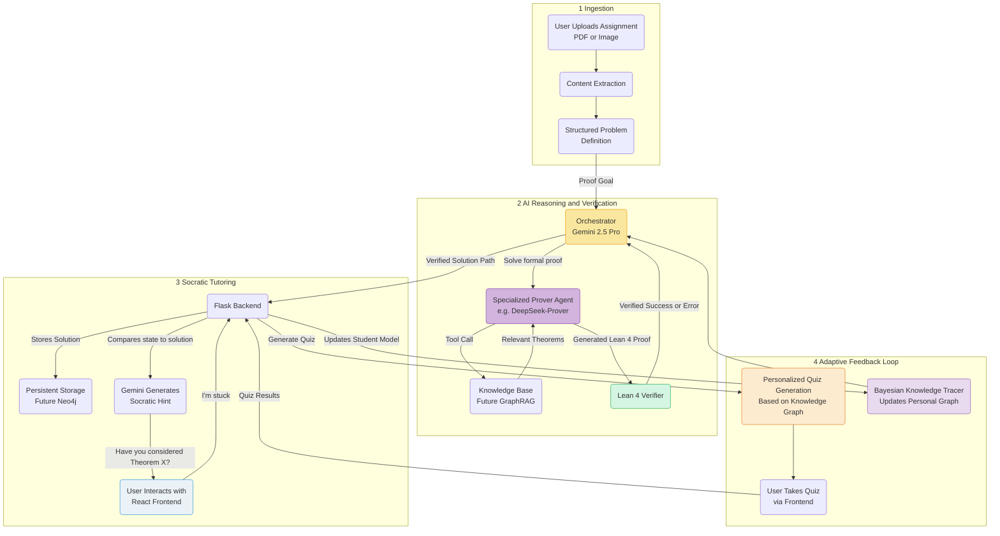
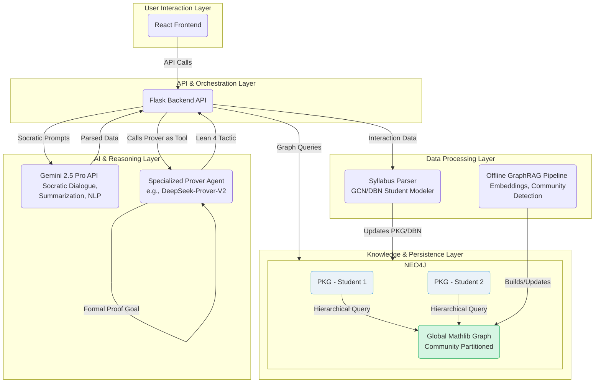
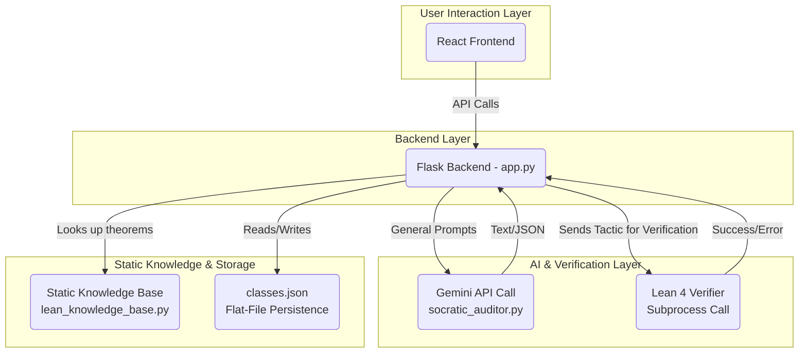

# **🚀 Altera Labs \- AI-Powered Math Education Platform**

An intelligent tutoring system combining Lean 4 theorem proving with AI to provide personalized math education.

## **🧠 The Core Workflow: From Homework to Insight**

The central value of Altera Labs lies not just in providing answers, but in creating a complete, adaptive learning cycle. The system uses a verified, correct solution to power effective Socratic tutoring, and then uses personalized quizzes to assess understanding and dynamically update each student's unique knowledge graph.  

### **Step 1: Ingestion and Problem Definition**

When a user uploads a homework assignment, the system first needs to understand the problem.

* **Current**: The backend uses PyMuPDF to extract raw text and LaTeX from the document, which is then parsed to define the proof goal.  
* **Future**: This stage will incorporate advanced OCR to handle handwritten problems and create a more robust, structured JSON representation of the task.

### **Step 2: AI-Powered Solution Generation & Verification**

This is where our unique hybrid AI architecture solves the problem *for itself* to establish a ground truth.

1. **Orchestration**: The structured problem is sent to our main **Orchestrator (Gemini 2.5 Pro)**. Its job is not to solve the proof directly, but to manage the process.  
2. **Delegation to Specialist**: The Orchestrator calls a **Specialized Prover Agent** (e.g., DeepSeek-Prover) as a tool. This agent is fine-tuned for formal theorem proving and is tasked with generating the step-by-step reasoning and corresponding Lean 4 code.  
3. **Formal Verification**: The generated Lean 4 code is immediately sent to the **Lean 4 Verifier**. This is our critical "grounding" step that guarantees correctness.

### **Step 3: Powering the Socratic Dialogue**

With a verified solution graph in hand, the AI Cognitive Partner is now ready to tutor.

* The AI **does not** simply show the user the solution.  
* Instead, the Orchestrator (Gemini) uses its natural language capabilities and the verified solution map to act as a Socratic tutor, providing minimal, strategic hints to guide the student.

### **Step 4: Adaptive Feedback & Quizzing**

This is the feedback loop that makes the learning experience truly dynamic and personalized.

1. **Quiz Generation**: Based on the topics the student has been working on and the current state of their Personal Knowledge Graph, the system can generate a personalized quiz to test for concept mastery.  
2. **Knowledge Tracing**: The student's performance on the quiz is analyzed. These results are fed into our **Bayesian Knowledge Tracing** model.  
3. **Graph Update**: The model updates the student's Personal Knowledge Graph, refining the system's understanding of their strengths and weaknesses. This new, more accurate graph then informs all future tutoring hints and quiz questions, creating a continuous cycle of learning, assessment, and adaptation.

## **🗺️ Project Roadmap**

Our development is structured in phases, moving from the current validated MVP to a scalable, enterprise-ready platform.

### **Phase 1: Foundation & MVP (Q3-Q4 2025\) \- ✅ Complete**

* **Status**: We have successfully built and validated the core "Verification-before-Tutoring" workflow.  
* **Key Achievements**:  
  * Functional Flask backend with a React frontend.  
  * Integration of Gemini 2.5 Pro for orchestration and Socratic dialogue.  
  * Successful implementation of the Lean 4 verifier as a subprocess for grounding AI-generated proofs.  
  * Robust Dev Container environment for rapid onboarding.

### **Phase 2: Knowledge Graph & Scalability (Q1-Q2 2026 \- The JHU Fuel Semester)**

* **Status**: This is our primary focus for the accelerator program.  
* **Key Objectives**:  
  1. **Implement Neo4j**: Migrate to a scalable graph database to store a "Global Mathlib Graph" and individual "Personal Knowledge Graphs" (PKGs).  
  2. **Develop GraphRAG Pipeline**: Build the offline pipeline to process mathematical libraries and generate embeddings.  
  3. **Implement Adaptive Quizzing**: Develop the module to generate personalized quizzes based on the student's knowledge graph. Integrate quiz results as a primary input into the Bayesian Knowledge Tracing model to dynamically update the PKG.  
  4. **Integrate Specialized Provers**: Formalize the integration of specialized prover agents as high-power tools.  
  5. **Initial JHU Pilot**: Begin limited pilot testing with a small cohort of JHU students.

### **Phase 3: Enhanced User Experience & Pilot Expansion (Q3-Q4 2026\)**

* **Status**: Post-accelerator scaling.  
* **Key Objectives**:  
  1. **Advanced Ingestion**: Implement robust syllabus and document parsing (leveraging OCR).  
  2. **Student Modeler**: Evolve the Bayesian model to track concept mastery and personalize long-term learning paths.  
  3. **Expand JHU Pilot Program**: Roll out the platform to select introductory proof-based courses.

### **Phase 4: Commercialization & Feature Expansion (2027 and beyond)**

* **Status**: Long-term vision.  
* **Key Objectives**:  
  * **Multi-Subject Support**: Expand the knowledge graph to support other formal domains like Physics, Logic, and advanced Computer Science.  
  * **Enterprise Licensing**: Develop a B2B model for university departments.

## 📋 Prerequisites (Install on Host Machine)

**Required:**
- **Docker Desktop**: [Install here](https://docs.docker.com/desktop/) - Required for dev containers
- **VS Code** or **Cursor**: [VS Code](https://code.visualstudio.com/) | [Cursor](https://www.cursor.com/) - Your IDE
- **Dev Containers Extension** (VS Code): [Install here](https://marketplace.visualstudio.com/items?itemName=ms-vscode-remote.remote-containers)
- **Node.js**: [Install here](https://nodejs.org/en/download/) - Required for cross-platform setup scripts
- **Google Cloud CLI**: See installation steps below - Required for AI integration

**Not Required (Provided by Container):**
- ✅ Python 3.10, Node.js 20, Git - Automatically installed in container
- ✅ Lean 4, npm dependencies - Set up during container build
- ✅ Virtual environment and Python packages - Created automatically

## 🎯 Quick Start

1) Clone the repository
```bash
git clone <repository-url>
cd Altera-Labs
```

2) Install and Authenticate Google Cloud CLI (FIRST-TIME SETUP ON HOST)
⚠️ **Do this BEFORE opening the dev container**

### 📥 Install Google Cloud CLI:

**🍎 macOS:**
```bash
# Option 1: Homebrew (recommended)
brew install google-cloud-sdk

# Option 2: Direct download
curl -O https://dl.google.com/dl/cloudsdk/channels/rapid/downloads/google-cloud-cli-darwin-arm.tar.gz
tar -xf google-cloud-cli-darwin-arm.tar.gz
./google-cloud-sdk/install.sh
```

**🪟 Windows:**
```powershell
# Download and run installer
(New-Object Net.WebClient).DownloadFile("https://dl.google.com/dl/cloudsdk/channels/rapid/GoogleCloudSDKInstaller.exe", "$env:Temp\GoogleCloudSDKInstaller.exe")
& $env:Temp\GoogleCloudSDKInstaller.exe
```
Or download installer manually: [GoogleCloudSDKInstaller.exe](https://dl.google.com/dl/cloudsdk/channels/rapid/GoogleCloudSDKInstaller.exe)

**🐧 Linux (Ubuntu/Debian):**
```bash
# Add Google Cloud package repository
curl https://packages.cloud.google.com/apt/doc/apt-key.gpg | sudo gpg --dearmor -o /usr/share/keyrings/cloud.google.gpg
echo "deb [signed-by=/usr/share/keyrings/cloud.google.gpg] https://packages.cloud.google.com/apt cloud-sdk main" | sudo tee -a /etc/apt/sources.list.d/google-cloud-sdk.list

# Install
sudo apt-get update && sudo apt-get install google-cloud-cli
```

### 🔑 Authenticate with Service Account:

**📋 Setup Instructions:**

1. **Login to your Google cloud account**: 'gcloud auth login'

2. **Get the service account key file** from the project owner
   - Request access to the `service-account-key.json` file
   - Contains credentials for: `service@altera-labs.iam.gserviceaccount.com`
   - **Important**: This file is not included in the repository for security reasons

2. **Place the key file in your project root:**
```bash
# Save the key file as 'service-account-key.json' in the Altera-Labs directory
# The file should be at: ./service-account-key.json
```

3. **Set the environment variable:**
```bash
# For current session:
export GOOGLE_APPLICATION_CREDENTIALS="$(pwd)/service-account-key.json"

# Make it permanent (add to your shell profile):
echo 'export GOOGLE_APPLICATION_CREDENTIALS="'"$(pwd)/service-account-key.json"'"' >> ~/.bashrc
source ~/.bashrc

# For Windows (PowerShell):
$env:GOOGLE_APPLICATION_CREDENTIALS = "$PWD\service-account-key.json"
```

4. **Verify authentication:**
```bash
gcloud auth application-default print-access-token
# Should return an access token if setup correctly
```

**🔒 Security Notes:**
- Never commit `service-account-key.json` to git (already in `.gitignore`)
- Keep the key file secure and don't share it publicly
- The dev container will automatically use this credential

### 📂 Credential Locations:
The dev container automatically mounts your credentials:
- **Mac/Linux**: `~/.config/gcloud` → `/home/vscode/.config/gcloud`  
- **Windows**: `%APPDATA%\gcloud` → `/home/vscode/.config/gcloud`

⚠️ **Critical**: Run these commands on your **host machine** (not inside the container)!

3) Verify your Google Cloud setup (IMPORTANT for Windows users)
```bash
# Check that gcloud is installed and authenticated
gcloud auth list

# Find your actual gcloud config directory (especially important on Windows)
gcloud info --format="value(config.paths.global_config_dir)"

# Verify Application Default Credentials exist
# Mac/Linux:
ls ~/.config/gcloud/application_default_credentials.json
# Windows (use the path from the command above):
dir "%APPDATA%\gcloud\application_default_credentials.json"
```

**🪟 Windows users**: The container automatically detects your gcloud path. If you have issues, ensure Node.js is installed.

4) Open in Dev Container
- Open the project in VS Code or Cursor
- Choose "Reopen in Container" when prompted
- First build takes ~5–10 minutes
- The container will automatically detect and mount your gcloud credentials

**Note**: Dependencies install automatically during container build with multiple fallback strategies.

5) Start development
```bash
# Use the management script (recommended)
./scripts/manage.sh development start

# Or manual:
# Backend (Flask API)
cd backend && python -m app

# Frontend (React + Vite)
# First time only, from repo root:
npm install
cd frontend && npm install && npm run dev
```

## 🔧 What the Dev Container Sets Up Automatically
- **Runtime**: Python 3.10, Node.js 20, Git (via dev container features)
- **Backend**: Project-local virtualenv at `.venv` with core dependencies from `backend/requirements.txt`
- **Frontend**: Tailwind/PostCSS toolchain + React dependencies via `npm install`
- **Lean 4**: Installed via `elan` with automatic `lake build` of `backend/lean_verifier`
- **Google Cloud**: Cross-platform credential mounting and verification
  - Automatically detects macOS (`~/.config/gcloud`) or Windows (`%APPDATA%\gcloud`) paths
  - Sets `GOOGLE_APPLICATION_CREDENTIALS` environment variable
  - Validates Application Default Credentials during setup
- **Environment Variables**: Pre-configured for Vertex AI integration
  - `VERTEX_AI_PROJECT_ID=altera-labs`
  - `VERTEX_AI_LOCATION=us-east1`
  - `GOOGLE_APPLICATION_CREDENTIALS=/home/vscode/.config/gcloud/application_default_credentials.json`
- **Performance**: Split dependency files for faster builds (see [Python Dependencies](#python-dependencies) below)

## 🏗️ Project Structure
```
Altera-Labs/
├── backend/                 # Python Flask API and Lean integration
│   ├── app.py               # Main application
│   ├── requirements.txt     # Core Python dependencies (auto-installed)
│   ├── requirements-ml.txt  # Heavy ML dependencies (optional)
│   ├── lean_verifier/       # Lean 4 project (lake)
│   └── tests/               # Pytest-based tests
├── frontend/                # React + TypeScript (Vite)
│   ├── package.json
│   └── ARCHITECTURE.md
├── scripts/                 # Helper scripts
│   └── manage.sh            # Unified management script
├── .devcontainer/           # Dev container configuration
│   ├── devcontainer.json
│   └── post-create.sh
├── docs/                    # Additional documentation
└── package.json             # Root toolchain (Tailwind/PostCSS)
```

## 🚀 Running the Application

- Backend (Flask API)
```bash
cd backend
python -m app
# API served at http://localhost:5000
```

- Frontend (React + Vite)
```bash
# First time on a new machine (from repo root)
npm install

cd frontend
npm install
npm run dev
# App served at http://localhost:5173
```

- Lean Development
```bash
cd backend/lean_verifier
lake build
```

## 🧪 Testing
- Backend: pytest in `backend/tests/`
```bash
cd backend
pytest
```
- Frontend: a test suite is not configured yet
- Lean: build via `lake build`

## 📦 Python Dependencies

The project uses **two separate requirements files** for optimal performance:

### `backend/requirements.txt` (Core Dependencies)
**Installed automatically during container build**
- Flask web framework and API dependencies
- Google Cloud Vertex AI SDK
- File processing utilities (PyMuPDF, pexpect)
- Core networking and data handling libraries

### `backend/requirements-ml.txt` (Heavy ML Dependencies)  
**Optional - install manually when needed**
- PyTorch (2GB+ download)
- Transformers library
- Accelerate and related ML libraries

### Why Split?
- **Faster container builds**: Core dependencies install in ~2 minutes vs 10+ minutes with ML libraries
- **Selective installation**: Only install heavy ML packages when actually needed
- **Development efficiency**: Most development work doesn't require the full ML stack

### Installing ML Dependencies
```bash
# Inside the dev container, if you need ML capabilities:
pip install -r backend/requirements-ml.txt

# Or set environment variable to auto-install during container build:
# Add INSTALL_ML_DEPS=true to your environment before building
```

## 🛠️ Management Script
Common tasks are consolidated in `./scripts/manage.sh`:
```bash
# Container
./scripts/manage.sh container rebuild
./scripts/manage.sh container diagnose

# Dependencies
./scripts/manage.sh dependencies verify
./scripts/manage.sh dependencies install

# Development
./scripts/manage.sh development start
./scripts/manage.sh development build

# Maintenance
./scripts/manage.sh maintenance cleanup
./scripts/manage.sh maintenance backup
```

## 📚 Documentation and Models
- Frontend Architecture: `frontend/ARCHITECTURE.md`
- Technical Specification: `TECHNICAL_SPEC.md`

### Models
- Primary LLM: Gemini 2.5 Pro (Vertex AI)
- Prover Agent: optional specialized prover (e.g., DeepSeek‑Prover‑V2) called as a tool
- Lean 4 + Mathlib for formal verification

## 🔐 Security Notes
- Google Cloud credentials (if present on host) are mounted read-only into the container
- No sensitive data is committed to the repository

## 🤝 Contributing
1. Fork the repository
2. Create a feature branch
3. Make changes with tests where applicable
4. Open a pull request

## 🔧 Troubleshooting

### Common Issues:
**Problem**: Dev container build fails
1. Ensure Docker is running: `docker info`
2. Check you have the service account key file: `ls service-account-key.json`
3. Rebuild container: Command Palette → "Dev Containers: Rebuild Container"

**Problem**: AI features not working (403 permission errors)
1. Ensure the `service-account-key.json` file is in your project root
2. Set the environment variable: `export GOOGLE_APPLICATION_CREDENTIALS="$(pwd)/service-account-key.json"`
3. Restart your terminal and rebuild the container
4. Verify with: `gcloud auth application-default print-access-token`

**Problem**: Application won't start
- The container automatically handles dependency installation with multiple fallback strategies
- If issues persist, check container build logs for specific errors

### 🔧 Verify Your Configuration (Advanced)
**For developers who want to validate their devcontainer.json:**
```bash
# Install Dev Container CLI (if not already installed)
npm install -g @devcontainers/cli

# Validate configuration syntax
devcontainer read-configuration --workspace-folder .

# Build container to test configuration
devcontainer build --workspace-folder .

# Test gcloud detection scripts
.devcontainer/setup-gcloud-mount.sh
.devcontainer/detect-gcloud-path.sh
```

## 📞 Getting Help
- Check the troubleshooting section above
- Review container build logs for specific error messages  
- Ensure all prerequisites are installed on your HOST machine
- Run the setup verification commands before opening the container

---

## 2.4. System Architecture Diagrams

The following diagrams visualize the planned architecture and the current implementation. These, along with our model choices, are central to the system design.

Diagram 1: Planned Hierarchical Knowledge Architecture



Diagram 2: Current Implemented Architecture


