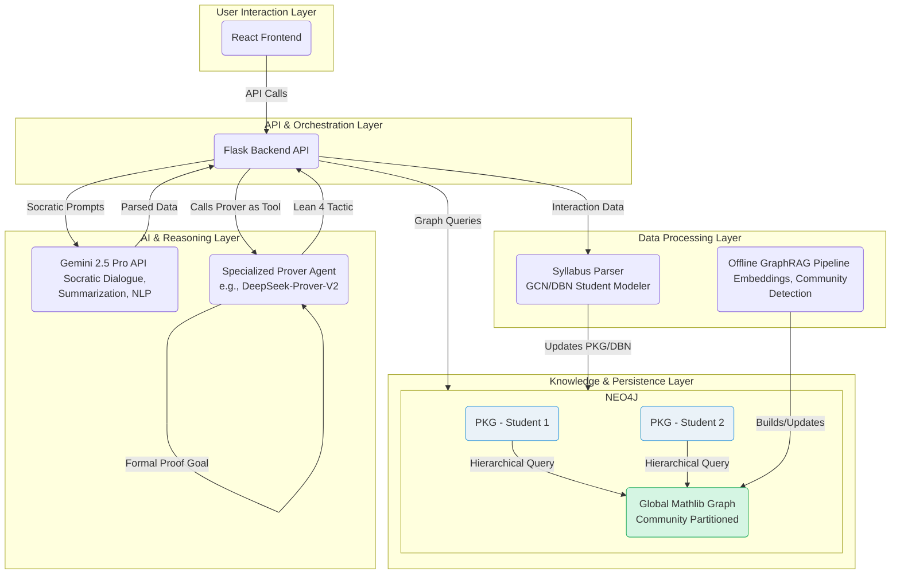
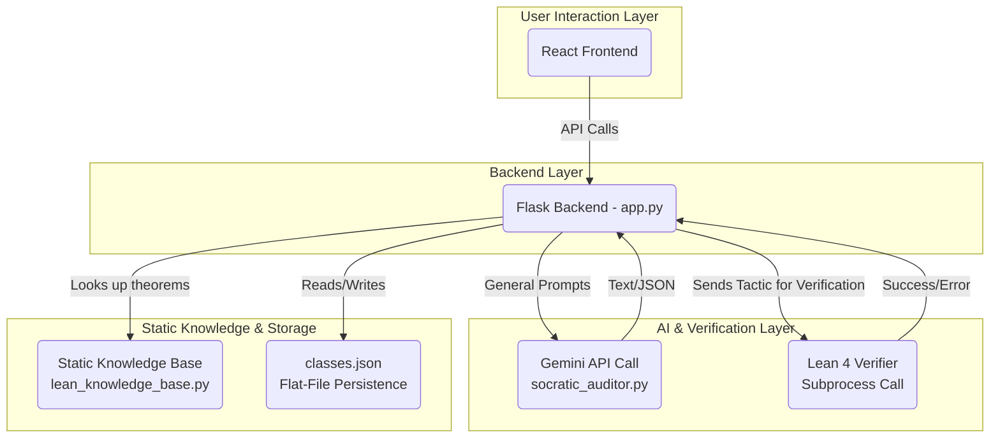

# 🚀 Altera Labs - AI-Powered Math Education Platform

An intelligent tutoring system combining Lean 4 theorem proving with AI to provide personalized math education.

## 📋 Prerequisites (Install on Host Machine)

**Required:**
- **Docker Desktop**: [Install here](https://docs.docker.com/desktop/) - Required for dev containers
- **VS Code** or **Cursor**: [VS Code](https://code.visualstudio.com/) | [Cursor](https://www.cursor.com/) - Your IDE
- **Dev Containers Extension** (VS Code): [Install here](https://marketplace.visualstudio.com/items?itemName=ms-vscode-remote.remote-containers)
- **Google Cloud CLI**: See installation steps below - Required for AI integration

**Not Required (Provided by Container):**
- ✅ Python 3.10, Node.js 20, Git - Automatically installed in container
- ✅ Lean 4, npm dependencies - Set up during container build
- ✅ Virtual environment and Python packages - Created automatically

## 🎯 Quick Start

1) Clone the repository
```bash
git clone <repository-url>
cd Altera-Labs
```

2) Install and Authenticate Google Cloud CLI (FIRST-TIME SETUP ON HOST)
⚠️ **Do this BEFORE opening the dev container**

### 📥 Install Google Cloud CLI:

**🍎 macOS:**
```bash
# Option 1: Homebrew (recommended)
brew install google-cloud-sdk

# Option 2: Direct download
curl -O https://dl.google.com/dl/cloudsdk/channels/rapid/downloads/google-cloud-cli-darwin-arm.tar.gz
tar -xf google-cloud-cli-darwin-arm.tar.gz
./google-cloud-sdk/install.sh
```

**🪟 Windows:**
```powershell
# Download and run installer
(New-Object Net.WebClient).DownloadFile("https://dl.google.com/dl/cloudsdk/channels/rapid/GoogleCloudSDKInstaller.exe", "$env:Temp\GoogleCloudSDKInstaller.exe")
& $env:Temp\GoogleCloudSDKInstaller.exe
```
Or download installer manually: [GoogleCloudSDKInstaller.exe](https://dl.google.com/dl/cloudsdk/channels/rapid/GoogleCloudSDKInstaller.exe)

**🐧 Linux (Ubuntu/Debian):**
```bash
# Add Google Cloud package repository
curl https://packages.cloud.google.com/apt/doc/apt-key.gpg | sudo gpg --dearmor -o /usr/share/keyrings/cloud.google.gpg
echo "deb [signed-by=/usr/share/keyrings/cloud.google.gpg] https://packages.cloud.google.com/apt cloud-sdk main" | sudo tee -a /etc/apt/sources.list.d/google-cloud-sdk.list

# Install
sudo apt-get update && sudo apt-get install google-cloud-cli
```

### 🔑 Authenticate:
```bash
# Initialize and configure
gcloud init

# Set up Application Default Credentials (required for Vertex AI)
gcloud auth application-default login
```

### 📂 Credential Locations:
The dev container automatically mounts your credentials:
- **Mac/Linux**: `~/.config/gcloud` → `/home/vscode/.config/gcloud`  
- **Windows**: `%APPDATA%\gcloud` → `/home/vscode/.config/gcloud`

⚠️ **Critical**: Run these commands on your **host machine** (not inside the container)!

3) Verify your Google Cloud setup (IMPORTANT for Windows users)
```bash
# Check that gcloud is installed and authenticated
gcloud auth list

# Find your actual gcloud config directory (especially important on Windows)
gcloud info --format="value(config.paths.global_config_dir)"

# Verify Application Default Credentials exist
# Mac/Linux:
ls ~/.config/gcloud/application_default_credentials.json
# Windows (use the path from the command above):
dir "%APPDATA%\gcloud\application_default_credentials.json"
```

**🪟 Windows users**: If you have mounting issues:
1. Run this detection script to find your actual gcloud path:
   ```bash
   .devcontainer/detect-gcloud-path.sh
   ```
2. If the path is different than `%APPDATA%\gcloud`, update `.devcontainer/devcontainer.json`:
   - Copy `.devcontainer/devcontainer-windows-template.json` to `.devcontainer/devcontainer.json`
   - Replace `REPLACE_WITH_YOUR_GCLOUD_PATH` with your actual path (e.g., `source=C:\\Users\\YourName\\AppData\\Roaming\\gcloud`)

4) Open in Dev Container
- Open the project in VS Code or Cursor
- Choose "Reopen in Container" when prompted
- First build takes ~5–10 minutes
- The container will automatically detect and mount your gcloud credentials

5) Start development
```bash
# Use the management script (recommended)
./scripts/manage.sh development start

# Or manual:
# Backend (Flask API)
cd backend && python -m app

# Frontend (React + Vite)
# First time only, from repo root:
npm install
cd frontend && npm install && npm run dev
```

## 🔧 What the Dev Container Sets Up Automatically
- **Runtime**: Python 3.10, Node.js 20, Git (via dev container features)
- **Backend**: Project-local virtualenv at `.venv` with core dependencies from `backend/requirements.txt`
- **Frontend**: Tailwind/PostCSS toolchain + React dependencies via `npm install`
- **Lean 4**: Installed via `elan` with automatic `lake build` of `backend/lean_verifier`
- **Google Cloud**: Cross-platform credential mounting and verification
  - Automatically detects macOS (`~/.config/gcloud`) or Windows (`%APPDATA%\gcloud`) paths
  - Sets `GOOGLE_APPLICATION_CREDENTIALS` environment variable
  - Validates Application Default Credentials during setup
- **Environment Variables**: Pre-configured for Vertex AI integration
  - `VERTEX_AI_PROJECT_ID=altera-labs`
  - `VERTEX_AI_LOCATION=us-east1`
  - `GOOGLE_APPLICATION_CREDENTIALS=/home/vscode/.config/gcloud/application_default_credentials.json`
- **Performance**: Split dependency files for faster builds (see [Python Dependencies](#python-dependencies) below)

## 🏗️ Project Structure
```
Altera-Labs/
├── backend/                 # Python Flask API and Lean integration
│   ├── app.py               # Main application
│   ├── requirements.txt     # Core Python dependencies (auto-installed)
│   ├── requirements-ml.txt  # Heavy ML dependencies (optional)
│   ├── lean_verifier/       # Lean 4 project (lake)
│   └── tests/               # Pytest-based tests
├── frontend/                # React + TypeScript (Vite)
│   ├── package.json
│   └── ARCHITECTURE.md
├── scripts/                 # Helper scripts
│   └── manage.sh            # Unified management script
├── .devcontainer/           # Dev container configuration
│   ├── devcontainer.json
│   └── post-create.sh
├── docs/                    # Additional documentation
└── package.json             # Root toolchain (Tailwind/PostCSS)
```

## 🚀 Running the Application

- Backend (Flask API)
```bash
cd backend
python -m app
# API served at http://localhost:5000
```

- Frontend (React + Vite)
```bash
# First time on a new machine (from repo root)
npm install

cd frontend
npm install
npm run dev
# App served at http://localhost:5173
```

- Lean Development
```bash
cd backend/lean_verifier
lake build
```

## 🧪 Testing
- Backend: pytest in `backend/tests/`
```bash
cd backend
pytest
```
- Frontend: a test suite is not configured yet
- Lean: build via `lake build`

## 📦 Python Dependencies

The project uses **two separate requirements files** for optimal performance:

### `backend/requirements.txt` (Core Dependencies)
**Installed automatically during container build**
- Flask web framework and API dependencies
- Google Cloud Vertex AI SDK
- File processing utilities (PyMuPDF, pexpect)
- Core networking and data handling libraries

### `backend/requirements-ml.txt` (Heavy ML Dependencies)  
**Optional - install manually when needed**
- PyTorch (2GB+ download)
- Transformers library
- Accelerate and related ML libraries

### Why Split?
- **Faster container builds**: Core dependencies install in ~2 minutes vs 10+ minutes with ML libraries
- **Selective installation**: Only install heavy ML packages when actually needed
- **Development efficiency**: Most development work doesn't require the full ML stack

### Installing ML Dependencies
```bash
# Inside the dev container, if you need ML capabilities:
pip install -r backend/requirements-ml.txt

# Or set environment variable to auto-install during container build:
# Add INSTALL_ML_DEPS=true to your environment before building
```

## 🛠️ Management Script
Common tasks are consolidated in `./scripts/manage.sh`:
```bash
# Container
./scripts/manage.sh container rebuild
./scripts/manage.sh container diagnose

# Dependencies
./scripts/manage.sh dependencies verify
./scripts/manage.sh dependencies install

# Development
./scripts/manage.sh development start
./scripts/manage.sh development build

# Maintenance
./scripts/manage.sh maintenance cleanup
./scripts/manage.sh maintenance backup
```

## 📚 Documentation and Models
- Frontend Architecture: `frontend/ARCHITECTURE.md`
- Technical Specification: `TECHNICAL_SPEC.md`

### Models
- Primary LLM: Gemini 2.5 Pro (Vertex AI)
- Prover Agent: optional specialized prover (e.g., DeepSeek‑Prover‑V2) called as a tool
- Lean 4 + Mathlib for formal verification

## 🔐 Security Notes
- Google Cloud credentials (if present on host) are mounted read-only into the container
- No sensitive data is committed to the repository

## 🤝 Contributing
1. Fork the repository
2. Create a feature branch
3. Make changes with tests where applicable
4. Open a pull request

## 🔧 Troubleshooting for First-Time Users

### Container Build Issues:
**Problem**: Dev container fails to build
```bash
# 1. Check if gcloud credentials exist on host
gcloud auth list
ls ~/.config/gcloud/application_default_credentials.json  # Mac/Linux

# 2. If missing, authenticate first:
gcloud auth application-default login

# 3. Rebuild container
# Command Palette → "Dev Containers: Rebuild Container"
```

**Problem**: "Google Cloud credentials not found" during build
- Make sure you installed gcloud CLI on your HOST machine (not in container)
- Run `gcloud auth application-default login` on HOST before opening container
- The build script will show platform-specific guidance if credentials are missing

**Problem**: Windows gcloud path detection issues
```bash
# 1. Find your actual gcloud config directory:
gcloud info --format="value(config.paths.global_config_dir)"

# 2. Run the detection script:
.devcontainer/detect-gcloud-path.sh

# 3. If the path is different than expected, you may need to:
#    - Update the mount in .devcontainer/devcontainer.json
#    - Use the exact path shown by the detection script
```

**Problem**: Windows mount permission errors
- Ensure Docker Desktop has access to your user directory
- Try running Docker Desktop as administrator
- Check that the gcloud config directory is accessible to Docker

### Application Issues:
**Problem**: Vertex AI authentication errors
```bash
# Inside the container, check if credentials are mounted:
ls -la /home/vscode/.config/gcloud/
echo $GOOGLE_APPLICATION_CREDENTIALS
```

**Problem**: Python/npm dependency issues
```bash
# Inside container, reinstall dependencies:
pip install -r backend/requirements.txt
cd frontend && npm install
```

### 🔧 Verify Your Configuration (Advanced)
**For developers who want to validate their devcontainer.json:**
```bash
# Install Dev Container CLI (if not already installed)
npm install -g @devcontainers/cli

# Validate configuration syntax
devcontainer read-configuration --workspace-folder .

# Build container to test configuration
devcontainer build --workspace-folder .

# Test gcloud detection scripts
.devcontainer/setup-gcloud-mount.sh
.devcontainer/detect-gcloud-path.sh
```

## 📞 Getting Help
- Check the troubleshooting section above
- Review container build logs for specific error messages  
- Ensure all prerequisites are installed on your HOST machine
- Run the setup verification commands before opening the container

---

## 2.4. System Architecture Diagrams

The following diagrams visualize the planned architecture and the current implementation. These, along with our model choices, are central to the system design.

Diagram 1: Planned Hierarchical Knowledge Architecture



Diagram 2: Current Implemented Architecture


