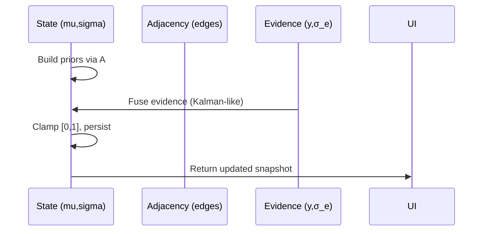

## Quiz Generation and Bayesian Knowledge Graph (BKG) Implementation Plan

### Overview
- **Goal**: Enable quiz generation from uploaded course documents and update a student’s Bayesian Knowledge Graph (BKG) with quiz results.
- **Scope**: Storage layout, data models, ingestion pipeline, quiz generation, BKG update engine, API contracts, frontend integration, configuration, testing, rollout.
- **Repo context**: Flask backend under `backend/`, React/TS frontend under `frontend/`. Existing persistent class storage at `data/classes.json`, RAG helpers in `rag_manager.py`, Bayesian logic utilities on the frontend in `frontend/services/bayesianService.ts`.
- **Preferences**: Devcontainer-first; dependencies installed in-container; use Vertex AI SDK (not deprecated GenAI SDK); global default model variable (default `gemini-2.5-flash`); do not use `GOOGLE_API_KEY`.

### Assumptions
- Backend remains Flask.
- Short-term persistence may use filesystem + JSON; production migrates to Postgres (+ optional Neo4j for concept graph analytics later).
- Vertex AI project and location are provided via environment variables already reflected in `backend/app.py`.

---

## 1) Folder & Storage Design

### 1.1 MVP Filesystem Layout
Under `backend/data/courses/{course_id}/`:

```
backend/data/courses/{course_id}/
  metadata.json                # course meta: name, term, instructor, syllabus references
  concepts.json                # canonical concept list (id, name, description)
  edges.json                   # adjacency with weights for concept correlation
  documents/
    {document_id}/
      raw/                     # original uploads (pdf, txt)
        {original_filename}
      normalized/
        text.txt               # UTF-8 normalized text
        markdown.md            # optional structured MD
      chunks/
        chunks.jsonl           # [{chunk_id, text, concept_tags[], embedding_vector_id}]
  quizzes/
    {quiz_id}/
      quiz.json                # items, blueprint, concept coverage, difficulty dist
      render.json              # UI render model (MCQ/cloze/short-answer variants)
  results/
    {student_id}/
      {quiz_id}.json           # attempt, responses, correctness, timestamps
  bkg/
    {student_id}.json          # current means/uncertainties per concept
    {student_id}.history.jsonl # append-only snapshots over time
```

Naming:
- `{course_id}`, `{document_id}`, `{quiz_id}`: UUIDv4.
- All JSON files UTF-8 with LF line endings; `.jsonl` for append-only logs.

### 1.2 Production Postgres Schema (DDL)

```sql
-- Courses and concepts
CREATE TABLE courses (
  id UUID PRIMARY KEY,
  name TEXT NOT NULL,
  term TEXT,
  metadata JSONB,
  created_at TIMESTAMPTZ DEFAULT now(),
  updated_at TIMESTAMPTZ DEFAULT now()
);

CREATE TABLE concepts (
  id UUID PRIMARY KEY,
  course_id UUID REFERENCES courses(id) ON DELETE CASCADE,
  slug TEXT NOT NULL,
  title TEXT NOT NULL,
  description TEXT,
  UNIQUE(course_id, slug)
);

CREATE TABLE concept_edges (
  course_id UUID REFERENCES courses(id) ON DELETE CASCADE,
  source_concept_id UUID REFERENCES concepts(id) ON DELETE CASCADE,
  target_concept_id UUID REFERENCES concepts(id) ON DELETE CASCADE,
  weight DOUBLE PRECISION NOT NULL,
  PRIMARY KEY (course_id, source_concept_id, target_concept_id)
);

-- Documents and chunks
CREATE TABLE documents (
  id UUID PRIMARY KEY,
  course_id UUID REFERENCES courses(id) ON DELETE CASCADE,
  original_filename TEXT,
  mime_type TEXT,
  checksum TEXT,
  bytes INT,
  normalized_text_path TEXT,
  created_at TIMESTAMPTZ DEFAULT now()
);

CREATE TABLE document_chunks (
  id UUID PRIMARY KEY,
  document_id UUID REFERENCES documents(id) ON DELETE CASCADE,
  course_id UUID REFERENCES courses(id) ON DELETE CASCADE,
  idx INT NOT NULL,
  text TEXT NOT NULL,
  embedding VECTOR(768), -- adjust dim to model
  concept_tags UUID[]    -- references concepts(id)
);

-- Quizzes and items
CREATE TABLE quizzes (
  id UUID PRIMARY KEY,
  course_id UUID REFERENCES courses(id) ON DELETE CASCADE,
  blueprint JSONB NOT NULL,
  created_by TEXT,
  created_at TIMESTAMPTZ DEFAULT now()
);

CREATE TYPE quiz_item_type AS ENUM ('mcq','cloze','short_answer');

CREATE TABLE quiz_items (
  id UUID PRIMARY KEY,
  quiz_id UUID REFERENCES quizzes(id) ON DELETE CASCADE,
  item_type quiz_item_type NOT NULL,
  payload JSONB NOT NULL,     -- text, options, answers, hints
  concept_coverage UUID[] NOT NULL,
  difficulty DOUBLE PRECISION NOT NULL
);

-- Attempts and responses
CREATE TABLE quiz_attempts (
  id UUID PRIMARY KEY,
  quiz_id UUID REFERENCES quizzes(id) ON DELETE CASCADE,
  student_id TEXT NOT NULL,
  started_at TIMESTAMPTZ DEFAULT now(),
  submitted_at TIMESTAMPTZ
);

CREATE TABLE quiz_responses (
  id UUID PRIMARY KEY,
  attempt_id UUID REFERENCES quiz_attempts(id) ON DELETE CASCADE,
  item_id UUID REFERENCES quiz_items(id) ON DELETE CASCADE,
  response JSONB NOT NULL,
  is_correct BOOLEAN NOT NULL,
  latency_ms INT
);

-- Student concept state (means and uncertainties)
CREATE TABLE student_concept_state (
  student_id TEXT,
  course_id UUID REFERENCES courses(id) ON DELETE CASCADE,
  concept_id UUID REFERENCES concepts(id) ON DELETE CASCADE,
  mu DOUBLE PRECISION NOT NULL,
  sigma DOUBLE PRECISION NOT NULL,
  updated_at TIMESTAMPTZ DEFAULT now(),
  PRIMARY KEY (student_id, course_id, concept_id)
);

-- Optional: history of updates
CREATE TABLE student_state_history (
  id UUID PRIMARY KEY,
  student_id TEXT,
  course_id UUID,
  snapshot JSONB NOT NULL,
  created_at TIMESTAMPTZ DEFAULT now()
);
```

Notes:
- Correlation is represented via `concept_edges.weight`. Covariance tracking can be added later with a compressed representation if needed (sparse covariance per student is expensive at scale).

---

## 2) Data Models & Types

### 2.1 Backend (Python)
Proposed module: `backend/models/entities.py`

```python
from dataclasses import dataclass
from typing import List, Dict, Optional

@dataclass
class Course:
    id: str
    name: str
    term: Optional[str]
    metadata: Dict

@dataclass
class Concept:
    id: str
    course_id: str
    slug: str
    title: str
    description: str

@dataclass
class ConceptEdge:
    course_id: str
    source_concept_id: str
    target_concept_id: str
    weight: float

@dataclass
class Document:
    id: str
    course_id: str
    original_filename: str
    mime_type: str
    checksum: str
    bytes: int
    normalized_text_path: str

@dataclass
class Chunk:
    id: str
    document_id: str
    course_id: str
    idx: int
    text: str
    embedding_vector_id: Optional[str]
    concept_tags: List[str]

@dataclass
class Quiz:
    id: str
    course_id: str
    blueprint: Dict

@dataclass
class QuizItem:
    id: str
    quiz_id: str
    item_type: str  # 'mcq' | 'cloze' | 'short_answer'
    payload: Dict
    concept_coverage: List[str]
    difficulty: float

@dataclass
class QuizAttempt:
    id: str
    quiz_id: str
    student_id: str

@dataclass
class QuizResponse:
    id: str
    attempt_id: str
    item_id: str
    response: Dict
    is_correct: bool
    latency_ms: Optional[int]

@dataclass
class StudentConceptState:
    student_id: str
    course_id: str
    concept_id: str
    mu: float
    sigma: float
```

### 2.2 Frontend (TypeScript)
Extend `frontend/types/learning.ts` or add `frontend/types/quiz.ts`:

```ts
export type QuizItemType = 'mcq' | 'cloze' | 'short_answer';

export interface QuizItem {
  id: string;
  itemType: QuizItemType;
  payload: any; // question, options, answers, hints
  conceptCoverage: string[]; // concept ids
  difficulty: number; // 0..1
}

export interface Quiz {
  id: string;
  courseId: string;
  items: QuizItem[];
  blueprint: Record<string, any>;
}

export interface QuizAttemptResponse {
  itemId: string;
  response: any;
  isCorrect: boolean;
  latencyMs?: number;
}

export interface QuizAttemptResult {
  attemptId: string;
  quizId: string;
  studentId: string;
  responses: QuizAttemptResponse[];
  updatedBkg: Record<string, { mu: number; sigma: number }>; // conceptId→state
}
```

---

## 3) Document Ingestion Pipeline

### 3.1 Modules
- `backend/services/ingestion/document_ingestor.py`
- `backend/services/ingestion/chunking.py`
- `backend/services/ingestion/concept_tagger.py`
- `backend/services/embeddings/vertex_embeddings.py`

### 3.2 Steps
1. Upload file → store under `documents/{document_id}/raw/`.
2. Normalize to text/markdown (`normalized/`).
3. Chunking: sliding window with configurable `chunk_size_chars` and `overlap_chars`.
4. Embeddings: call Vertex embeddings (batch with retry/backoff) → persist vectors (either in DB VECTOR column or local vector store id).
5. Concept tagging: for each chunk, score against concepts via embeddings similarity; optionally refine with LLM ranking using global `DEFAULT_MODEL`.
6. Persist chunks, concept tags, update course manifest.
7. Dedup by checksum; skip re-ingestion unless `force=true`.

### 3.3 Vertex Embeddings
- Use Vertex AI SDK; configure project/location from env; global default model variable for generative tasks.
- Embedding model suggestion: `text-embedding-004` (updateable via config).

### 3.4 Configuration
- Add `backend/config/quiz_bkg_config.py` with:
  - `CHUNK_SIZE = 1200`, `CHUNK_OVERLAP = 200`
  - `EMBEDDING_MODEL = 'text-embedding-004'`
  - `DEFAULT_MODEL = os.environ.get('DEFAULT_LLM_MODEL', 'gemini-2.5-flash')`
  - Retry policy, batch sizes, rate limits

---

## 4) Quiz Generation Service

### 4.1 Modules
- `backend/services/quiz/quiz_generator.py`
- `backend/services/quiz/item_writers/mcq.py`
- `backend/services/quiz/item_writers/cloze.py`
- `backend/services/quiz/item_writers/short_answer.py`
- `backend/services/quiz/blueprints.py`

### 4.2 Algorithm
- Inputs: `{studentId, courseId, targetConcepts?, length, difficulty}`.
- Select target concepts prioritizing high uncertainty and syllabus relevance.
- Retrieve relevant chunks per concept.
- Generate candidate stems/answers; for MCQ, generate distractors that reflect common misconceptions.
- Calibrate difficulty by: distractor plausibility, required steps, and linguistic complexity.
- Ensure coverage diversity and avoid duplicates via chunk checksums.
- Output: `Quiz` with `items[]` and `conceptCoverage` per item.

### 4.3 Cost/Latency Controls
- Cache per-course embeddings and per-concept summaries.
- Limit tokens via concise prompts; batch LLM calls.
- Use temperature/determinism appropriate for item type.

---

## 5) Bayesian Knowledge Graph Update

### 5.1 Model
- Student state: vector of per-concept mastery with uncertainty `(mu_i, sigma_i)`.
- Concept correlations: adjacency weights `w_{i←j}` from `concept_edges` or `edges.json`.
- For each answered item with concept coverage vector `w` and correctness `y ∈ {0,1}`, compute posterior updates on targeted concepts and propagate via adjacency.

### 5.2 Update Engine Module
- `backend/services/bkg/update_engine.py`
- Functions:
  - `build_priors(course_edges, knowledge_state)`
  - `update_with_item(prior_state, item, response)`
  - `apply_decay(prior_state, last_updated)` (optional)
  - `persist_snapshot(student_id, course_id, state)`

### 5.3 Math and Pseudocode
Approximate linear-Gaussian update consistent with current frontend utility:

```text
Given:
- Prior for concept i: (mu_i, sigma_i)
- Evidence for an item: y ∈ {0,1}
- Evidence model: mu_e = y, sigma_e = σ_e (e.g., 0.1)
- Influence to target concept i from neighbors j: weights a_{i←j}

Compute prior for i via influence row a_i:
  mu_prior_i = clamp( Σ_j a_{i←j} * mu_j , 0, 1 )
  sigma_prior_i = sqrt( Σ_j (a_{i←j}^2 * sigma_j^2) )

Kalman-like fusion:
  τ_p = 1 / sigma_prior_i^2
  τ_e = 1 / sigma_e^2
  mu_post_i = clamp( (mu_prior_i*τ_p + mu_e*τ_e) / (τ_p + τ_e), 0, 1 )
  sigma_post_i = sqrt( 1 / (τ_p + τ_e) )

Slip/guess extension (optional):
  Use mu_e = P(correct|mastery) = (1−slip) for y=1, = guess for y=0,
  or shift evidence via logistic mapping before fusion.
```

Pseudocode:

```python
def update_item(prior_state, item):
    concepts = item.concept_coverage
    is_correct = item.is_correct
    mu_e = 1.0 if is_correct else 0.0
    sigma_e = CONFIG.EVIDENCE_SIGMA

    for c in concepts:
        mu_prior, sigma_prior = build_prior_for_concept(c, prior_state, edges)
        mu_post, sigma_post = fuse(mu_prior, sigma_prior, mu_e, sigma_e)
        prior_state[c] = (mu_post, sigma_post)

    return prior_state
```

### 5.4 Storage and History
- Persist `student_concept_state` after each submission.
- Append full snapshot to history for auditability and analysis.
- Cold start: initialize `(mu=0.3, sigma=0.5)` for unseen concepts (aligned with current backend default).

---

## 6) API Endpoints (Backend, Flask)

All routes are under `/api` to match existing conventions in `backend/app.py`.

### 6.1 Upload & Ingestion
- `POST /api/courses/{courseId}/documents:upload`
  - FormData: `file`
  - Returns: `{ documentId }`

- `POST /api/courses/{courseId}/ingest`
  - JSON: `{ documentId, force?: boolean }`
  - Triggers normalization, chunking, embeddings, tagging
  - Returns: `{ status: 'started', documentId }`

### 6.2 Quiz Lifecycle
- `POST /api/courses/{courseId}/quizzes:generate`
  - JSON: `{ studentId, targetConcepts?: string[], length?: number, difficulty?: number }`
  - Returns: `{ quizId }`

- `GET /api/courses/{courseId}/quizzes/{quizId}`
  - Returns: `Quiz` with `items[]`

- `POST /api/students/{studentId}/quizzes/{quizId}:submit`
  - JSON: `{ responses: { itemId, response }[] }`
  - Returns: `{ attemptId, updatedBkg }`

### 6.3 BKG Read API
- `GET /api/students/{studentId}/courses/{courseId}/bkg`
  - Returns: `{ conceptId: { mu, sigma } }`

### 6.4 Errors & Idempotency
- Upload is idempotent by checksum; ingestion skips if unchanged unless `force`.
- Standard errors: 400 (bad input), 404 (not found), 409 (conflict), 500 (server).

---

## 7) Frontend Integration

### 7.1 Services
- `frontend/services/quizService.ts`
  - `uploadDocument(courseId, file)`
  - `ingestDocument(courseId, documentId, force?)`
  - `generateQuiz(courseId, studentId, params)`
  - `getQuiz(courseId, quizId)`
  - `submitQuiz(studentId, quizId, responses)`

- Extend `frontend/services/bayesianService.ts`
  - Add adapters to map server `updatedBkg` → local state
  - Keep existing calculations for client-side previews if needed

### 7.2 UI Components (`frontend/components/learning/Quiz/`)
- `QuizStart.tsx`: parameters, concept selection, difficulty
- `QuizRunner.tsx`: render items, collect responses, track latency
- `QuizReview.tsx`: show correctness, explanations, and BKG deltas

### 7.3 UX Flow
1. Select course → upload docs → show ingestion progress
2. Generate quiz (defaults length=5, mixed difficulty)
3. Take quiz → submit → show updated concept graph with uncertainty bands

---

## 8) Configuration, Devcontainer, and Vertex AI

### 8.1 Configuration
- Centralize in `backend/config/quiz_bkg_config.py`:
  - `DEFAULT_MODEL = os.environ.get('DEFAULT_LLM_MODEL', 'gemini-2.5-flash')`
  - `VERTEX_PROJECT = os.environ['VERTEX_AI_PROJECT_ID']`
  - `VERTEX_LOCATION = os.environ['VERTEX_AI_LOCATION']`
  - `EMBEDDING_MODEL = 'text-embedding-004'`
  - Evidence parameters: `EVIDENCE_SIGMA = 0.1`, slip/guess defaults

### 8.2 Devcontainer
- Ensure python deps: `google-genai`, `pymupdf` (and DB drivers if used).
- Node deps: align with current frontend; add types if introducing new libs.

### 8.3 Observability
- Structured logs with request IDs.
- Persist ingestion/quiz generation metrics for debugging.

---

## 9) Testing Strategy

### 9.1 Unit Tests (backend)
- `chunking.py`: deterministic chunk boundaries.
- `concept_tagger.py`: tagging on fixed fixtures.
- `update_engine.py`: fusion math on known vectors; edge cases (σ≈0, all-correct/all-wrong).
- `quiz_generator.py`: blueprint coverage, difficulty bounds, distractor uniqueness.

### 9.2 Integration Tests
- Flow: upload → ingest → generate quiz → submit → check `updatedBkg` monotonicity and plausibility.
- Add sample course under `backend/data/sample_course/` for fixtures.

### 9.3 Frontend Tests
- `QuizRunner` renders items; response capture and submission; review view.

---

## 10) Security, Privacy, Compliance
- Validate file types; limit size; sanitize text.
- Separate student identifiers from PII; support pseudonymous `student_id` in MVP.
- Access control: only enrolled students can access a course (stub in MVP, enforce later).
- Store only necessary data; encrypt at rest in production DB.

---

## 11) Rollout Plan
- MVP: filesystem storage + JSON manifests; synchronous ingestion (small docs); no auth.
- Phase 2: Postgres for durability, background workers for ingestion, simple JWT auth.
- Phase 3: Neo4j for advanced concept analytics; scalable vector store; full RBAC.

Migration:
- Provide one-time migrator from filesystem → Postgres tables.

---

## 12) Risks & Mitigations
- **Auto concept-tagging accuracy**: human-in-the-loop review; thresholding; LLM rerankers.
- **Quiz quality**: curated templates; distractor libraries; offline QA sampling.
- **Update instability**: cap evidence weight; smoothing/decay; rollback via snapshots.
- **Latency/cost**: batching, caching summaries, configurable item counts.

---

## 13) Timeline & Task Breakdown (3–4 weeks)

Week 1
- Backend ingestion modules and config
- Vertex embeddings integration and tests
- Filesystem layout + sample course fixtures

Week 2
- Quiz generator with MCQ/cloze; blueprints; basic endpoints
- Frontend `quizService` and `QuizRunner`

Week 3
- BKG update engine backend; submission endpoint; history persistence
- Frontend BKG visualization deltas; review view

Week 4
- Hardening: tests, observability, error handling, docs
- Optional Postgres migration scaffolding

Acceptance Criteria
- Upload→Ingest→Generate→Submit flow works end-to-end
- BKG updates reflect correctness with reasonable bounds
- Quiz items meet coverage and difficulty constraints
- Plan documented and configs adjustable in devcontainer

---

## 14) Diagrams

### 14.1 Data Flow


### 14.2 BKG Update (per item)




